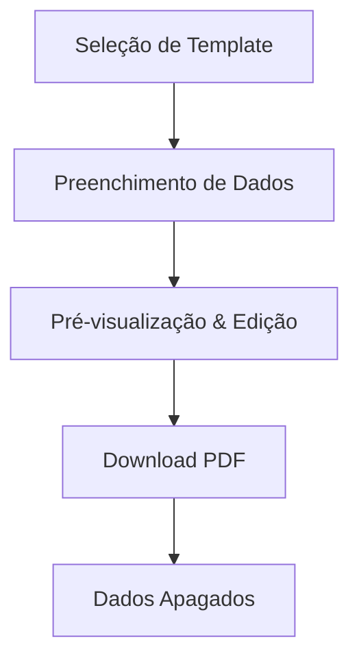
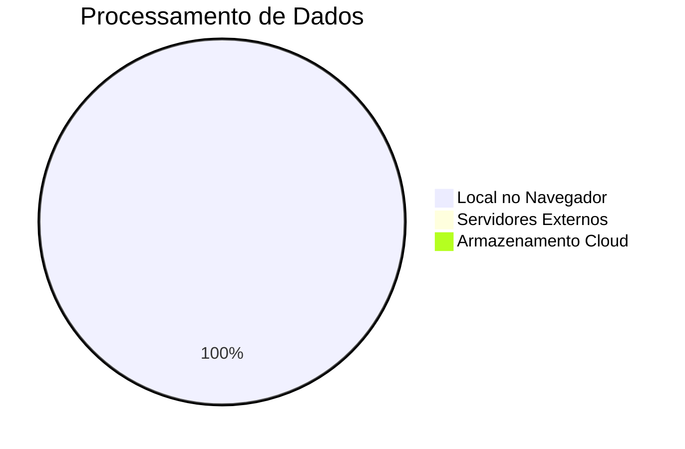
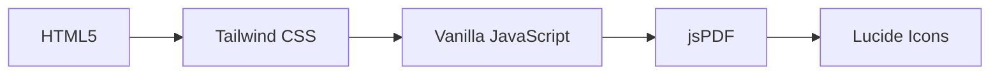
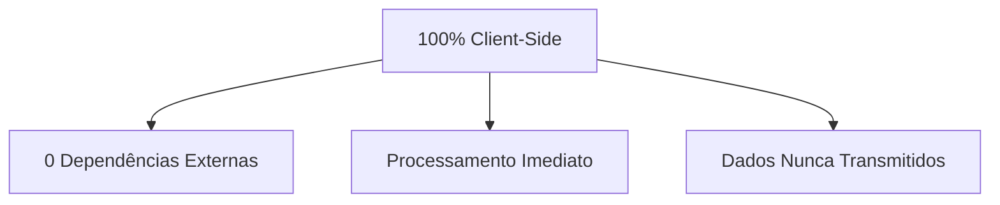
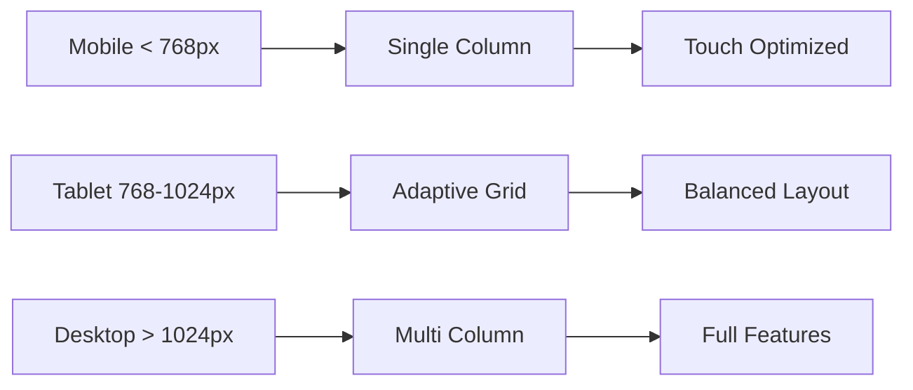

# 📄 ContratoFácil - Gerador de Contratos Simples


## 🌟 Visão Geral

**ContratoFácil** é uma aplicação web elegante e totalmente privada que permite criar contratos legais profissionais em minutos. Desenvolvido com foco total na privacidade do utilizador - todos os dados processam-se localmente no seu navegador.



## 🚀 Funcionalidades Principais

### 📋 Templates Disponíveis
| Tipo de Contrato | Ícone | Descrição | Complexidade |
|------------------|-------|-----------|--------------|
| 🏠 Arrendamento Habitacional | `home` | Para arrendamento de casa/apartamento | ⭐⭐☆ |
| 💼 Prestação de Serviços | `pen-tool` | Para freelancers/empresas | ⭐⭐☆ |
| 💰 Mútuo (Empréstimo) | `dollar-sign` | Empréstimo entre particulares | ⭐☆☆ |

### 🛡️ Características de Segurança


## 🎯 Como Utilizar

### 1. **Seleção do Template**
```bash
📁 Dashboard → 🏠 Arrendamento → 📝 Formulário
```

### 2. **Preenchimento Inteligente**
- Campos organizados por secções
- Validação em tempo real
- Salvamento automático local

### 3. **Geração e Edição**
```javascript
// Exemplo de fluxo
template.generate(data) → preview → edit → downloadPDF()
```

### 4. **Exportação**
- PDF profissional
- Formatação otimizada
- Sem marcas d'água

## 🛠️ Tecnologias Utilizadas

### Frontend Stack


### Dependências Principais
| Tecnologia | Versão | Propósito |
|------------|---------|-----------|
| Tailwind CSS | CDN | Estilização responsiva |
| jsPDF | 2.5.1 | Geração de PDFs |
| Lucide Icons | Latest | Ícones modernos |

## 📊 Métricas do Projeto

### Estatísticas de Uso


### Performance
| Métrica | Valor | Impacto |
|---------|-------|---------|
| Tamanho Base | ~15KB | 🚀 Carregamento Instantâneo |
| Processamento PDF | <500ms | ⚡ Geração Rápida |
| Armazenamento | LocalStorage | 💾 Persistência Local |

## 🎨 Interface do Utilizador

### Design System
```css
/* Cores Principais */
--primary: #2563eb;    /* Azul principal */
--secondary: #64748b;  /* Cinza neutro */
--background: #f8fafc; /* Fundo claro */
--surface: #ffffff;    /* Superfícies */
```

### Componentes Principais
- **Dashboard**: Grid de templates com ícones
- **Formulário**: Campos agrupados por secção
- **Preview**: Editor em tempo real com sidebar de ações

## 🔧 Estrutura do Código

### Organização dos Templates
```javascript
const TEMPLATES = [
    {
        id: 'arrendamento',
        title: 'Arrendamento Habitacional',
        icon: 'home',
        fields: [...],
        generate: (data) => `...`
    }
    // ... mais templates
];
```

### Gestão de Estado
```javascript
const state = {
    view: 'dashboard', // dashboard | form | preview
    currentTemplateId: null,
    formData: {},
    finalText: ''
};
```

## 🌐 Compatibilidade

| Navegador | Suporte | Notas |
|-----------|---------|-------|
| Chrome 90+ | ✅ Completo | Recomendado |
| Firefox 88+ | ✅ Completo | - |
| Safari 14+ | ✅ Completo | - |
| Edge 90+ | ✅ Completo | - |

## 📱 Responsividade



## 🔒 Privacidade e Segurança

### Garantias de Privacidade
- ✅ Zero telemetria
- ✅ Processamento 100% local
- ✅ Sem cookies de rastreamento
- ✅ Dados armazenados apenas no localStorage
- ✅ Código aberto e verificável

### Aviso Legal
> ℹ️ O ContratoFácil fornece minutas padronizadas. Recomendamos consulta com um advogado para situações complexas.

## 🚀 Instalação e Uso

### Método 1: Uso Imediato
```bash
# Basta abrir o ficheiro HTML no navegador
open contratofacil.html
```

### Método 2: Hospedagem Local
```bash
# Com Python
python -m http.server 8000

# Com Node.js
npx http-server
```

## 📈 Roadmap Futuro

### Próximas Funcionalidades
- [ ] Mais templates de contrato
- [ ] Suporte para múltiplos idiomas
- [ ] Modo escuro
- [ ] Histórico de documentos
- [ ] Assinatura digital integrada

## 🤝 Contribuições

Contribuições são bem-vindas! Areas de melhoria:

1. **Novos Templates**: Adicione mais tipos de contrato
2. **Internacionalização**: Traduções para outros idiomas
3. **Acessibilidade**: Melhorias de WCAG
4. **Testes**: Suíte de testes automatizados

## 📄 Licença

Este projeto é distribuído sob a licença MIT. Veja o ficheiro `LICENSE` para mais detalhes.

## 🐛 Reportar Problemas

Encontrou um bug? [Abra uma issue](https://github.com/seu-usuario/contratofacil/issues) com:

- Descrição detalhada
- Passos para reproduzir
- Navegador e versão
- Captura de ecrã (se aplicável)

## 📞 Suporte

**Email**: andrrr.discord@gmail.com 
**Documentação**: [Wiki do Projeto](https://github.com/Luzisrepo/Contrato-Facil/wiki)  
**Comunidade**: [Discussions](https://github.com/Luzisrepo/Contrato-Facil/discussions)

---

<div align="center">

**Desenvolvido com ❤️ para a comunidade portuguesa**

*"Simplificando a burocracia, um contrato de cada vez"*


</div>
