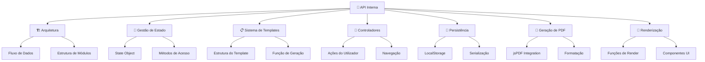
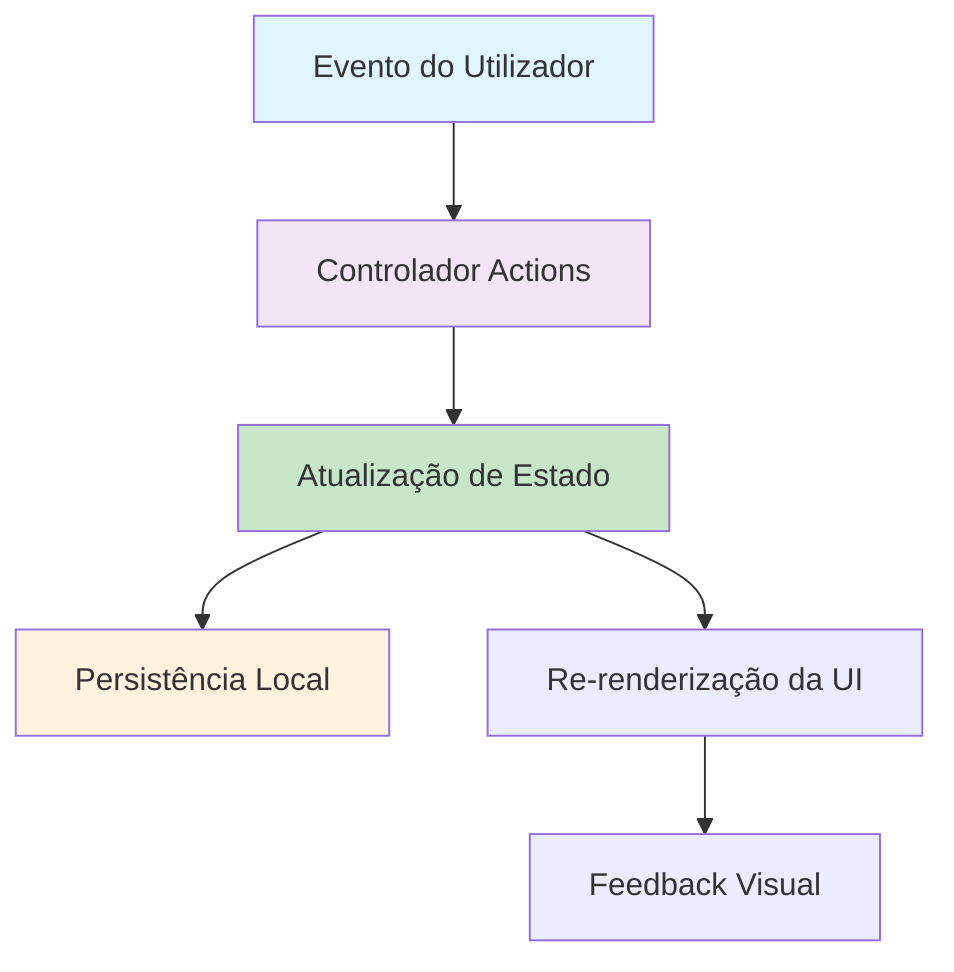
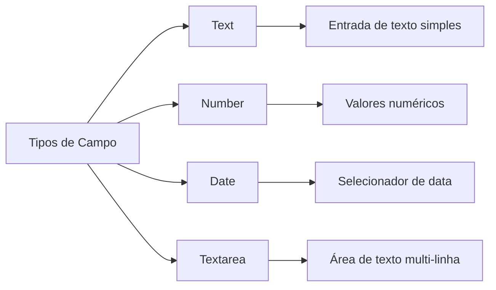
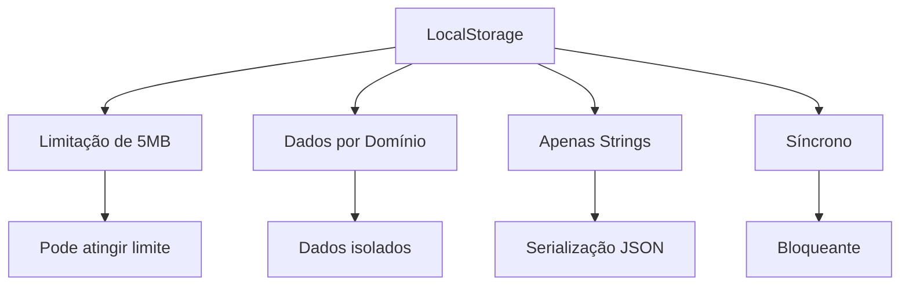
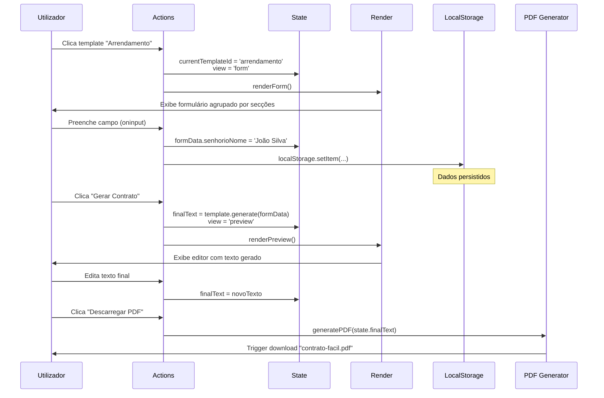

# 🔌 API Interna - ContratoFácil


## 🗂️ Índice da Documentação da API



## 🏗️ Arquitetura da API

### Fluxo de Dados Principal



### Módulos Principais

| Módulo | Responsabilidade | Dependências | Escopo |
|--------|------------------|--------------|---------|
| `state` | Gestão do estado da aplicação | - | Global |
| `TEMPLATES` | Definição dos modelos de contrato | - | Constante |
| `actions` | Controladores de interação | `state`, `TEMPLATES` | Global |
| `render*` | Funções de renderização da UI | `state` | Por vista |
| `pdfGenerator` | Geração de documentos PDF | `jsPDF` | Local |

## 📁 Gestão de Estado

### Estrutura do State Object

```javascript
const state = {
    // Vista atual da aplicação
    view: 'dashboard', // 'dashboard' | 'form' | 'preview'
    
    // ID do template selecionado
    currentTemplateId: null, // string | null
    
    // Dados do formulário (persistentes)
    formData: {
        // Chave: valor dos campos preenchidos
        campo1: 'valor1',
        campo2: 'valor2'
    },
    
    // Texto final do contrato (após geração)
    finalText: '' // string
};
```

### Métodos de Acesso ao Estado

#### Atualização de Campo
```javascript
// Atualiza um campo específico e persiste no localStorage
actions.updateField('nomeCampo', 'valor');

// Exemplo prático
actions.updateField('senhorioNome', 'João Silva');
```

#### Consulta do Estado
```javascript
// Verificar vista atual
console.log(state.view); // 'dashboard', 'form', 'preview'

// Verificar template selecionado
console.log(state.currentTemplateId); // 'arrendamento', 'servicos', etc.

// Acessar dados específicos
console.log(state.formData.senhorioNome);
```

## 📋 Sistema de Templates

### Estrutura de um Template

```javascript
{
    // Identificador único do template
    id: 'arrendamento',
    
    // Metadados para exibição
    title: 'Arrendamento Habitacional',
    icon: 'home',
    description: 'Para arrendamento de casa ou apartamento para habitação.',
    
    // Definição dos campos do formulário
    fields: [
        {
            name: 'senhorioNome',       // Chave única
            label: 'Nome do Senhorio',  // Rótulo visível
            type: 'text',               // Tipo de input
            section: 'Primeiro Outorgante (Senhorio)' // Agrupamento
        }
        // ... mais campos
    ],
    
    // Função de geração do contrato
    generate: (data) => `CONTRATO DE ARRENDAMENTO...`
}
```

### Função de Geração - Especificações Técnicas

```javascript
/**
 * Gera o texto do contrato com base nos dados fornecidos
 * @param {Object} data - Dados do formulário
 * @param {string} data.campo1 - Valor do campo1
 * @param {string} data.campo2 - Valor do campo2
 * @returns {string} Texto completo do contrato formatado
 */
generate: (data) => {
    return `
CONTRATO DE ARRENDAMENTO HABITACIONAL

ENTRE:
PRIMEIRO OUTORGANTE: ${data.senhorioNome || '[NOME SENHORIO]'}, 
contribuinte fiscal n.º ${data.senhorioNif || '[NIF]'}, 
residente em ${data.senhorioMorada || '[MORADA]'}, 
doravante designado por "Senhorio";

[...resto do contrato]
    `.trim();
}
```

### Campos e Tipos Suportados



| Tipo | Uso | Validação | Exemplo |
|------|-----|-----------|---------|
| `text` | Nomes, NIF, Moradas | Sem validação | `"João Silva"` |
| `number` | Valores, Dias, Meses | Apenas números | `1500`, `12` |
| `date` | Datas | Formato ISO | `"2024-01-15"` |
| `textarea` | Descrições longas | Sem validação | Texto multi-linha |

## 🔄 Controladores (Actions)

### actions.selectTemplate(templateId)
```javascript
/**
 * Seleciona um template e navega para o formulário
 * @param {string} templateId - ID do template a selecionar
 */
actions.selectTemplate('arrendamento');
```

**Fluxo de Execução:**
1. Valida se `templateId` existe em `TEMPLATES`
2. Atualiza `state.currentTemplateId`
3. Muda `state.view` para `'form'`
4. Executa `renderForm()`

### actions.goBack()
```javascript
/**
 * Retorna à vista anterior (dashboard)
 */
actions.goBack();
```

**Fluxo de Execução:**
1. Limpa `state.currentTemplateId` (null)
2. Muda `state.view` para `'dashboard'`
3. Executa `renderDashboard()`

### actions.updateField(name, value)
```javascript
/**
 * Atualiza um campo específico no estado
 * @param {string} name - Nome do campo
 * @param {string} value - Novo valor
 */
actions.updateField('senhorioNome', 'Maria Santos');
```

**Fluxo de Execução:**
1. Atualiza `state.formData[name] = value`
2. Persiste `state.formData` no localStorage
3. **Não** trigger re-render (performance)

### actions.generate()
```javascript
/**
 * Gera o contrato final e navega para pré-visualização
 */
actions.generate();
```

**Fluxo de Execução:**
1. Obtém template: `TEMPLATES.find(t => t.id === state.currentTemplateId)`
2. Executa: `template.generate(state.formData)`
3. Armazena resultado em `state.finalText`
4. Muda `state.view` para `'preview'`
5. Executa `renderPreview()`

### actions.editForm()
```javascript
/**
 * Volta ao formulário a partir da pré-visualização
 */
actions.editForm();
```

**Fluxo de Execução:**
1. Muda `state.view` para `'form'`
2. Executa `renderForm()`

### actions.updateFinalText(value)
```javascript
/**
 * Atualiza o texto final durante a edição
 * @param {string} value - Novo texto do contrato
 */
actions.updateFinalText(novoTexto);
```

**Fluxo de Execução:**
1. Atualiza `state.finalText = value`
2. **Não** persiste no localStorage (temporário)

### actions.resetApp()
```javascript
/**
 * Reinicia completamente a aplicação
 */
actions.resetApp();
```

**Fluxo de Execução:**
1. Mostra `confirm` de confirmação
2. Se confirmado:
   - Limpa `state.currentTemplateId`
   - Muda `state.view` para `'dashboard'`
   - Executa `renderDashboard()`

### actions.downloadPDF()
```javascript
/**
 * Gera e descarrega o PDF do contrato
 */
actions.downloadPDF();
```

**Fluxo de Execução:**
1. Altera estado do botão para "A Gerar..."
2. Cria nova instância do jsPDF
3. Formata e adiciona o texto
4. Gera e trigger download
5. Restaura estado do botão

## 💾 Persistência de Dados

### Estrutura do LocalStorage

| Chave | Valor | Descrição | Expiração |
|-------|-------|-----------|-----------|
| `contratoFacil_data` | `JSON string` | Dados de todos os formulários | Manual |

### Serialização e Desserialização

```javascript
// Serialização (salvar)
const saveData = (data) => {
    try {
        localStorage.setItem('contratoFacil_data', JSON.stringify(data));
        return true;
    } catch (e) {
        console.error('Erro ao salvar dados:', e);
        return false;
    }
};

// Desserialização (carregar)
const loadData = () => {
    try {
        return JSON.parse(localStorage.getItem('contratoFacil_data')) || {};
    } catch (e) {
        console.error('Erro ao carregar dados:', e);
        return {};
    }
};
```

### Limitações e Considerações



## 📄 Geração de PDF

### Integração com jsPDF

```javascript
const generatePDF = (text) => {
    const { jsPDF } = window.jspdf;
    const doc = new jsPDF();
    
    // Configurações do documento
    doc.setFont("helvetica");
    doc.setFontSize(12);
    
    // Quebra de texto para caber na página
    const splitText = doc.splitTextToSize(text, 180);
    
    // Adiciona texto com paginação
    let cursorY = 20;
    const pageHeight = 280;
    const lineHeight = 7;

    splitText.forEach(line => {
        if (cursorY > pageHeight) {
            doc.addPage();
            cursorY = 20;
        }
        doc.text(line, 15, cursorY);
        cursorY += lineHeight;
    });
    
    return doc;
};
```

### Especificações de Formatação

| Parâmetro | Valor | Descrição |
|-----------|-------|-----------|
| Fonte | `helvetica` | Fonte padrão sans-serif |
| Tamanho | `12pt` | Legibilidade ideal |
| Largura | `180 units` | ~19cm com margens |
| Margens | `15 units` | Margem esquerda |
| Altura Página | `280 units` | Altura útil |
| Espaçamento | `7 units` | Entre linhas |

### Tratamento de Erros

```javascript
try {
    const doc = generatePDF(state.finalText);
    doc.save("contrato-facil.pdf");
} catch (error) {
    console.error('Erro ao gerar PDF:', error);
    // Fallback: oferecer download como texto
    downloadAsText(state.finalText);
}
```

## 🎨 Sistema de Renderização

### Funções de Render Principais

#### renderDashboard()
```javascript
/**
 * Renderiza a vista inicial com templates
 */
function renderDashboard() {
    const html = `
        <div class="fade-in max-w-4xl mx-auto px-4 py-8">
            ${/* Grid de templates */}
        </div>
    `;
    appContainer.innerHTML = html;
    lucide.createIcons();
}
```

#### renderForm()
```javascript
/**
 * Renderiza o formulário baseado no template atual
 */
function renderForm() {
    const template = TEMPLATES.find(t => t.id === state.currentTemplateId);
    if (!template) return renderDashboard();

    // Agrupa campos por secção
    const sections = groupFieldsBySection(template.fields);
    
    const html = `
        <div class="slide-in max-w-2xl mx-auto px-4 py-8">
            ${/* Estrutura do formulário */}
        </div>
    `;
    appContainer.innerHTML = html;
    lucide.createIcons();
}
```

#### renderPreview()
```javascript
/**
 * Renderiza a vista de pré-visualização e edição
 */
function renderPreview() {
    const html = `
        <div class="fade-in max-w-4xl mx-auto px-4 py-8 h-full flex flex-col">
            ${/* Editor e sidebar de ações */}
        </div>
    `;
    appContainer.innerHTML = html;
    lucide.createIcons();
}
```

### Componentes UI Reutilizáveis

#### Campo de Formulário
```javascript
const renderField = (field, value = '') => {
    const baseClasses = "w-full p-3 border border-slate-300 rounded-lg focus:ring-2 focus:ring-blue-500 focus:border-blue-500";
    
    if (field.type === 'textarea') {
        return `<textarea id="${field.name}" oninput="actions.updateField('${field.name}', this.value)" class="${baseClasses} min-h-[100px]">${value}</textarea>`;
    }
    
    return `<input type="${field.type}" id="${field.name}" value="${value}" oninput="actions.updateField('${field.name}', this.value)" class="${baseClasses}">`;
};
```

#### Cartão de Template
```javascript
const renderTemplateCard = (template) => `
    <button 
        onclick="actions.selectTemplate('${template.id}')"
        class="bg-white p-6 rounded-xl border border-slate-200 shadow-sm hover:shadow-md hover:border-blue-300 transition-all text-left flex flex-col gap-4 group focus:ring-4 focus:ring-blue-100 w-full"
        aria-label="Criar contrato de ${template.title}"
    >
        <div class="p-3 bg-blue-50 text-blue-600 rounded-lg w-fit group-hover:bg-blue-600 group-hover:text-white transition-colors">
            <i data-lucide="${template.icon}" width="24" height="24"></i>
        </div>
        <div>
            <h3 class="font-bold text-lg text-slate-900">${template.title}</h3>
            <p class="text-slate-500 text-sm mt-1 leading-relaxed">${template.description}</p>
        </div>
    </button>
`;
```

## 🔄 Fluxo de Eventos Completo

### Sequência: Criação de Contrato



### Tratamento de Erros e Edge Cases

```javascript
// Exemplo: Template não encontrado
const template = TEMPLATES.find(t => t.id === state.currentTemplateId);
if (!template) {
    console.warn(`Template não encontrado: ${state.currentTemplateId}`);
    actions.goBack();
    return;
}

// Exemplo: Dados corrompidos no localStorage
try {
    state.formData = JSON.parse(localStorage.getItem('contratoFacil_data')) || {};
} catch (e) {
    console.error('Dados corrompidos no localStorage, a limpar...');
    localStorage.removeItem('contratoFacil_data');
    state.formData = {};
}
```

## 🧪 Testes e Debugging

### Funções de Utilidade para Debug

```javascript
// Debug helper
const debugState = () => {
    return {
        view: state.view,
        currentTemplate: state.currentTemplateId,
        formFields: Object.keys(state.formData).length,
        finalTextLength: state.finalText.length,
        localStorage: localStorage.getItem('contratoFacil_data') ? 'Presente' : 'Vazio'
    };
};

// Verificar templates carregados
console.log('Templates disponíveis:', TEMPLATES.map(t => t.id));
```

### Pontos de Verificação Comuns

1. **Estado Inicial**: `state.view === 'dashboard'`
2. **Template Selection**: `state.currentTemplateId` existe em `TEMPLATES`
3. **Dados Persistidos**: `localStorage` contém JSON válido
4. **Geração PDF**: `jsPDF` está carregado globalmente

---

<div align="center">

## 🛠️ API Interna - ContratoFácil

**📧 Suporte Técnico**: andrrr.discord@gmail.com
**🐙 Issues**: [GitHub Issues](https://github.com/Luzisrepo/Contrato-Facil/issues)  
**📚 Documentação**: [Wiki Completa](https://github.com/Luzisrepo/Contrato-Facil/docs/wiki.md)

*"Arquitetura simples, poder complexo"* 🚀

</div>
