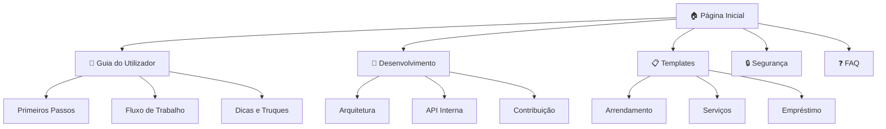
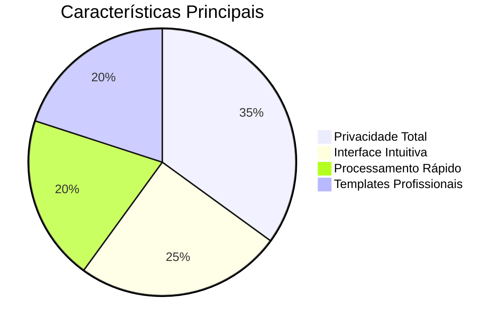
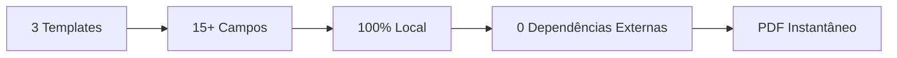
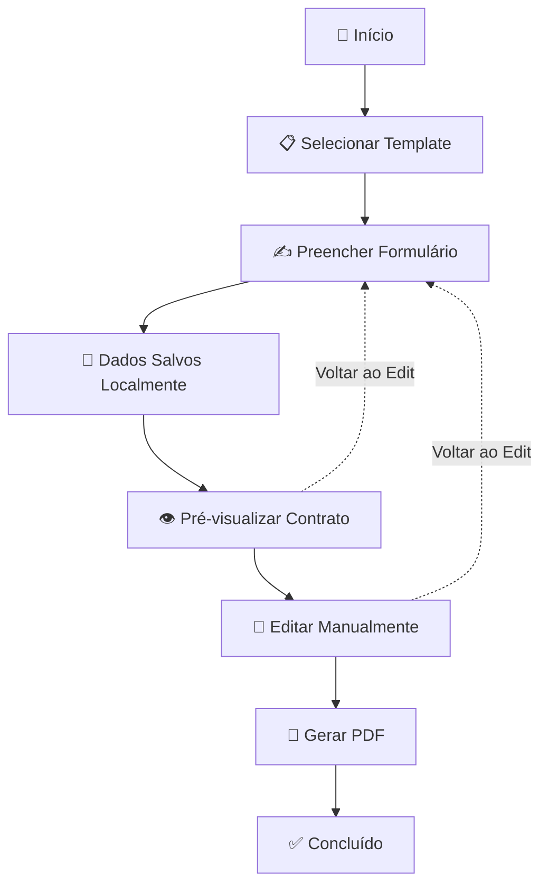
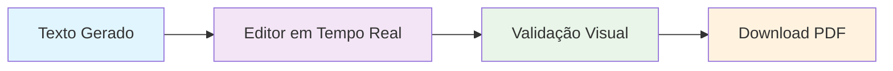
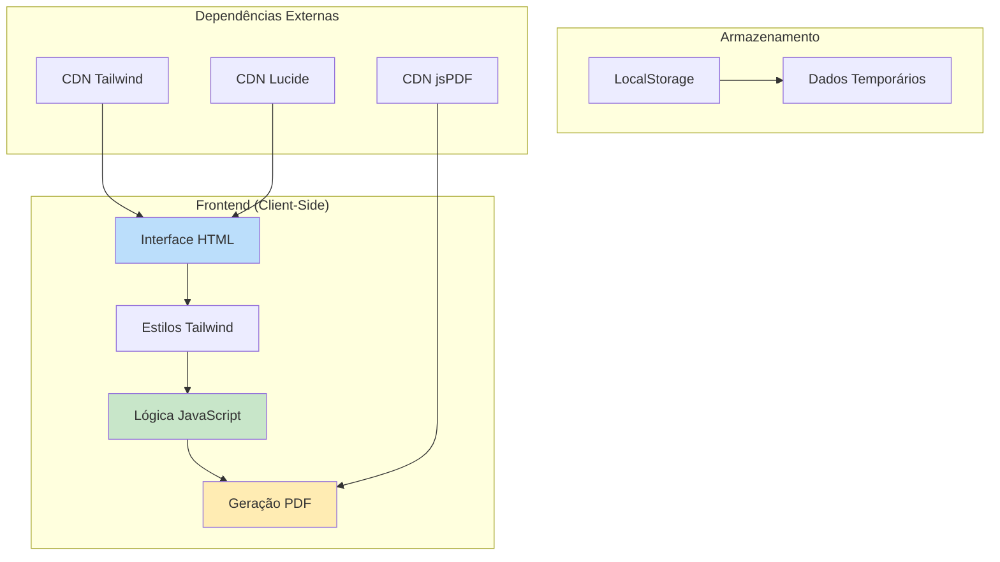
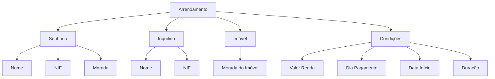
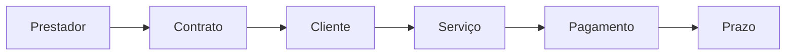
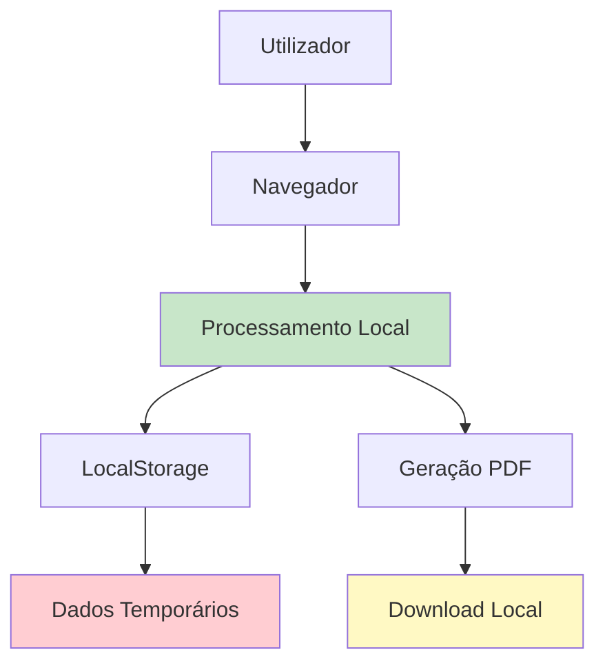
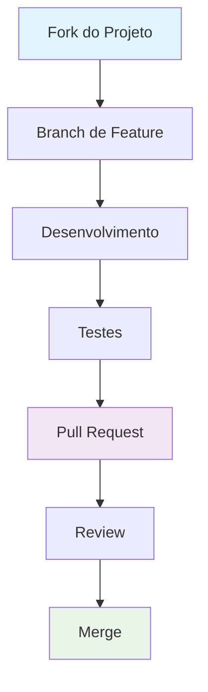

# 📚 Wiki - ContratoFácil


## 🗂️ Índice da Documentação



---

## 🏠 Página Inicial

### 🌟 Bem-vindo à Wiki do ContratoFácil

O **ContratoFácil** é uma solução web inovadora que transforma a criação de documentos legais em uma experiência simples, segura e eficiente.



### 🎯 Objetivos do Projeto

| Objetivo | Descrição | Status |
|----------|-----------|--------|
| **Simplicidade** | Interface amigável para não técnicos | ✅ Concluído |
| **Privacidade** | Processamento 100% local | ✅ Concluído |
| **Acessibilidade** | Compatível com diversos dispositivos | ✅ Concluído |
| **Profissionalismo** | Documentos juridicamente sólidos | 🔄 Contínuo |

### 📈 Estatísticas do Projeto



---

## 📖 Guia do Utilizador

### 🚀 Primeiros Passos

#### Requisitos do Sistema
| Componente | Requisito Mínimo | Recomendado |
|------------|------------------|-------------|
| Navegador | Chrome 90+ | Chrome 110+ |
| Memória RAM | 512MB | 2GB+ |
| Resolução | 320px (mobile) | 1920px (desktop) |
| JavaScript | Ativado | Ativado |

#### Inicialização Rápida
```bash
# Método 1: Abrir diretamente
📁 Abrir ficheiro index.html no navegador

# Método 2: Servidor local
python -m http.server 8080
# Acessar: http://localhost:8080
```

### 🔄 Fluxo de Trabalho Completo



#### 1. Seleção de Template
- **Localização**: Página inicial (Dashboard)
- **Ação**: Clique no template desejado
- **Feedback Visual**: Animação de hover e foco

#### 2. Preenchimento do Formulário
```javascript
// Estrutura típica do formulário
{
    seção: "Dados Pessoais",
    campos: [
        { nome: "text", obrigatório: true },
        { nif: "text", obrigatório: true },
        { morada: "textarea", obrigatório: false }
    ]
}
```

#### 3. Salvamento Automático
- **Tecnologia**: localStorage do navegador
- **Frequência**: A cada alteração
- **Capacidade**: ~5MB por domínio

#### 4. Pré-visualização e Edição


### 💡 Dicas e Truques

#### Atalhos de Produtividade
| Ação | Atalho | Descrição |
|------|---------|-----------|
| Navegação Rápida | Tab/Shift+Tab | Movimento entre campos |
| Limpar Dados | Botão Reset | Retorna ao dashboard |
| Download Rápido | Botão Download | Gera PDF imediatamente |

#### Melhores Práticas
1. **Preencha todos os campos obrigatórios**
2. **Revise o contrato gerado**
3. **Guarde uma cópia do PDF**
4. **Consulte um profissional para casos complexos**

---

## 🔧 Desenvolvimento

### 🏗️ Arquitetura do Sistema



### 📁 Estrutura de Ficheiros
```
contratofacil/
├── 📄 index.html                 # Aplicação principal
├── 📁 docs/                     # Documentação
│   ├── 📄 wiki.md              # Esta wiki
│   └── 📄 api-interna.md       # Documentação da API
├── 📁 assets/                  # Recursos estáticos
│   ├── 📁 icons/              # Ícones personalizados
│   └── 📁 screenshots/        # Capturas de ecrã
└── 📄 README.md               # Documentação principal
```

### 🔌 API Interna

#### Gestão de Estado
```javascript
// Estrutura do State Object
const state = {
    view: 'dashboard',          // Vista atual
    currentTemplateId: null,    // Template selecionado
    formData: {},               // Dados do utilizador
    finalText: ''               // Texto gerado
};
```

#### Sistema de Templates
```javascript
// Estrutura de um Template
{
    id: 'identificador-unico',
    title: 'Nome Amigável',
    icon: 'lucide-icon',
    description: 'Descrição detalhada',
    fields: [
        {
            name: 'nomeCampo',
            label: 'Rótulo Visível',
            type: 'text|number|date|textarea',
            section: 'Agrupamento'
        }
    ],
    generate: (data) => `Texto do contrato...`
}
```

### 🎨 Sistema de Design

#### Paleta de Cores
| Cor | Uso | Código HEX |
|-----|-----|------------|
| Azul Primário | Botões, Links | `#2563eb` |
| Cinza Neutro | Texto Secundário | `#64748b` |
| Verde Sucesso | Confirmações | `#10b981` |
| Amarelo Aviso | Alertas | `#f59e0b` |

#### Componentes UI
```css
/* Botão Primário */
.btn-primary {
    @apply bg-blue-600 text-white px-4 py-2 rounded-lg hover:bg-blue-700;
}

/* Cartão */
.card {
    @apply bg-white p-6 rounded-xl border border-slate-200 shadow-sm;
}

/* Campo de Formulário */
.form-field {
    @apply w-full p-3 border border-slate-300 rounded-lg focus:ring-2 focus:ring-blue-500;
}
```

---

## 📋 Templates

### 🏠 Arrendamento Habitacional

#### Campos Obrigatórios


#### Estrutura Legal Gerada
- **Partes Contratantes**: Identificação completa
- **Objeto do Contrato**: Descrição do imóvel
- **Condições Financeiras**: Renda e pagamentos
- **Duração**: Prazo e renovações
- **Cláusulas Legais**: Conformidade com a lei portuguesa

### 💼 Prestação de Serviços

#### Fluxo de Trabalho


#### Campos Específicos
| Campo | Tipo | Importância |
|-------|------|-------------|
| Descrição do Serviço | Textarea | ⭐⭐⭐⭐⭐ |
| Valor Total | Number | ⭐⭐⭐⭐⭐ |
| Prazo de Execução | Number | ⭐⭐⭐⭐ |
| NIF/NIPC | Text | ⭐⭐⭐ |

### 💰 Mútuo (Empréstimo)

#### Estrutura Simplificada
```javascript
const contratoEmprestimo = {
    partes: {
        mutuante: "Quem empresta",
        mutuario: "Quem recebe"
    },
    termos: {
        valor: "Quantia emprestada",
        devolucao: "Data limite",
        juros: "Taxa aplicável"
    }
};
```

---

## 🔒 Segurança e Privacidade

### 🛡️ Modelo de Segurança



### 📊 Política de Dados

| Tipo de Dado | Armazenamento | Partilha | Duração |
|-------------|---------------|----------|---------|
| Dados Pessoais | localStorage | Nunca | Até limpeza do cache |
| Texto do Contrato | Memória | Nunca | Sessão atual |
| PDF Gerado | Sistema de ficheiros | Controlo do utilizador | Indefinida |

### 🔐 Medidas de Proteção

#### 1. Isolamento Completo
- Zero chamadas de rede
- Sem analytics ou telemetria
- Dependências via CDN (apenas leitura)

#### 2. Limpeza de Dados
```javascript
// Limpeza manual
localStorage.removeItem('contratoFacil_data');

// Limpeza automática
// Os dados persistem até o utilizador limpar o cache
```

#### 3. Transparência
- Código aberto
- Documentação completa
- Sem código ofuscado

---

## ❓ FAQ (Perguntas Frequentes)

### 🤔 Utilização Básica

#### P: Os meus dados estão seguros?
**R:** Sim! A aplicação funciona 100% no seu navegador. Os dados nunca saem do seu dispositivo.

#### P: Preciso de criar conta?
**R:** Não. O ContratoFácil não requer registo ou autenticação.

#### P: Posso usar offline?
**R:** Sim, após o primeiro carregamento, pode usar a aplicação sem conexão à internet.

### 📄 Documentos e Legalidade

#### P: Os contratos são legalmente válidos?
**R:** Os templates seguem a legislação portuguesa, mas recomendamos consulta com um advogado para casos específicos.

#### P: Posso modificar o contrato gerado?
**R:** Sim, o editor final permite modificações completas antes do download.

#### P: Que tipos de contrato estão disponíveis?
**R:** Atualmente: Arrendamento, Prestação de Serviços e Empréstimo entre particulares.

### 🔧 Problemas Técnicos

#### P: O PDF não está a gerar. O que fazer?
**R:** Verifique se o JavaScript está ativado e tente com outro navegador.

#### P: Perdi os meus dados. Como recuperar?
**R:** Os dados são mantidos no localStorage até limpar o cache do navegador.

#### P: A aplicação está lenta no meu dispositivo.
**R:** Recomendamos usar Chrome ou Firefox atualizados. A aplicação é leve e deve funcionar em maioria dos dispositivos.

### 🚀 Funcionalidades Futuras

#### P: Vão adicionar mais templates?
**R:** Sim! Estamos constantemente a expandir a biblioteca de templates.

#### P: Haverá versão mobile app?
**R:** Atualmente focamos na versão web responsiva, que funciona em todos os dispositivos.

---

## 📞 Suporte e Comunidade

### 🎯 Canais de Apoio

| Tipo de Suporte | Canal | Tempo de Resposta |
|-----------------|-------|-------------------|
| 🐛 Reportar Bugs | GitHub Issues | 24-48h |
| 💡 Sugestões | GitHub Discussions | 48-72h |
| ❓ Dúvidas Gerais | FAQ & Wiki | Imediato |
| 🔒 Questões de Segurança | Email Privado | 24h |

### 👥 Como Contribuir



### Áreas de Contribuição Prioritárias:
1. **Novos Templates** 📋
2. **Traduções** 🌍
3. **Melhorias de Acessibilidade** ♿
4. **Testes Automatizados** 🧪

---

<div align="center">

## 🎉 Obrigado por Usar o ContratoFácil!

**📧 Email**: andrrr.discord@gmail.com 
**🐙 GitHub**: [https://github.com/Luzisrepo/Contrato-Facil](https://github.com/Luzisrepo/Contrato-Facil)  

*"Tornando a criação de contratos acessível a todos"* ✨

</div>
